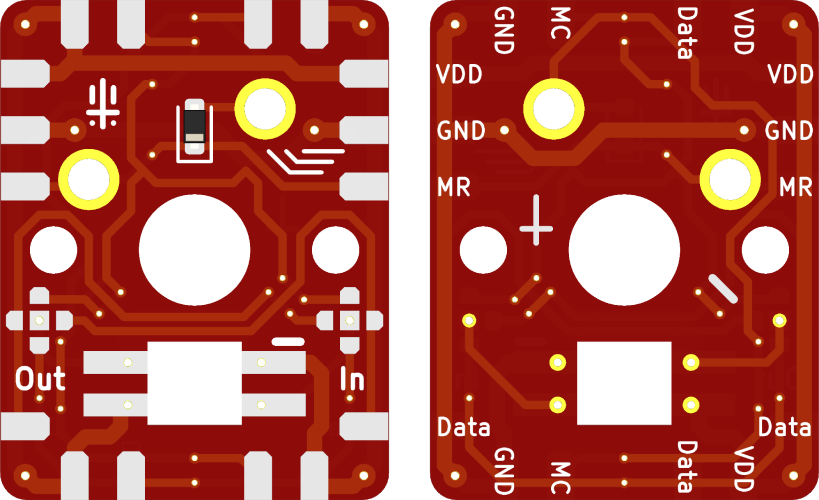

# [keebernetic](../../README.md) : PCBs : key
Simple PCB for each switch \
Measures 14 mm x 18 mm \
Includes two routers (`In` and `Out`) for connecting the LED data pins

### BOM
- MX compatible switch
- 1N4148 sod-523
- SK6812 mini-E

### Preview

